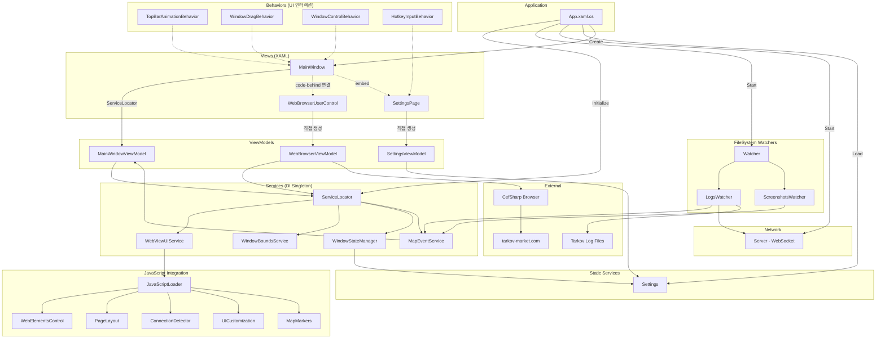
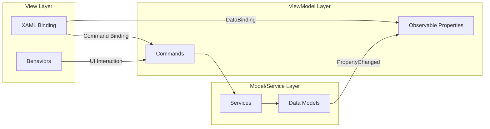
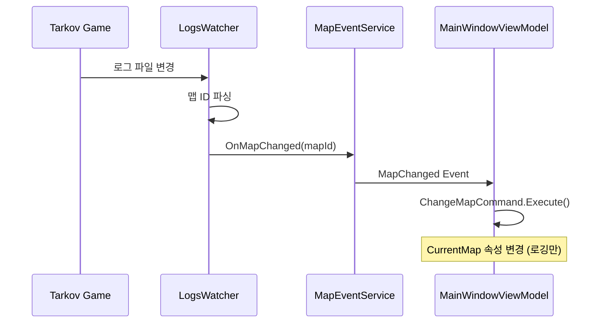
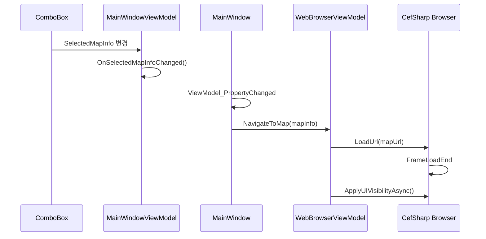
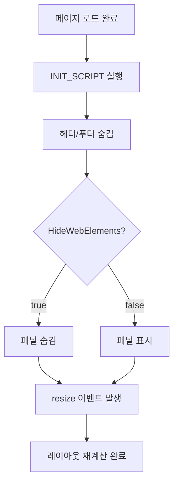
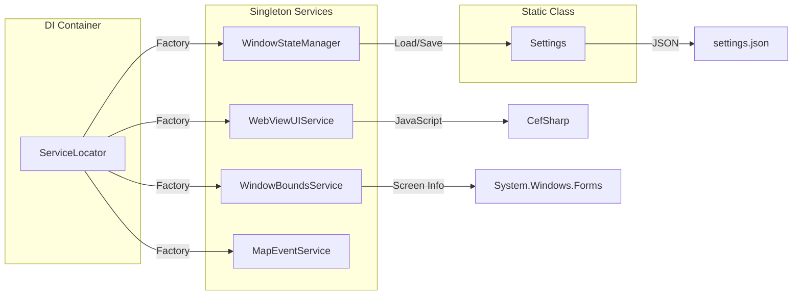
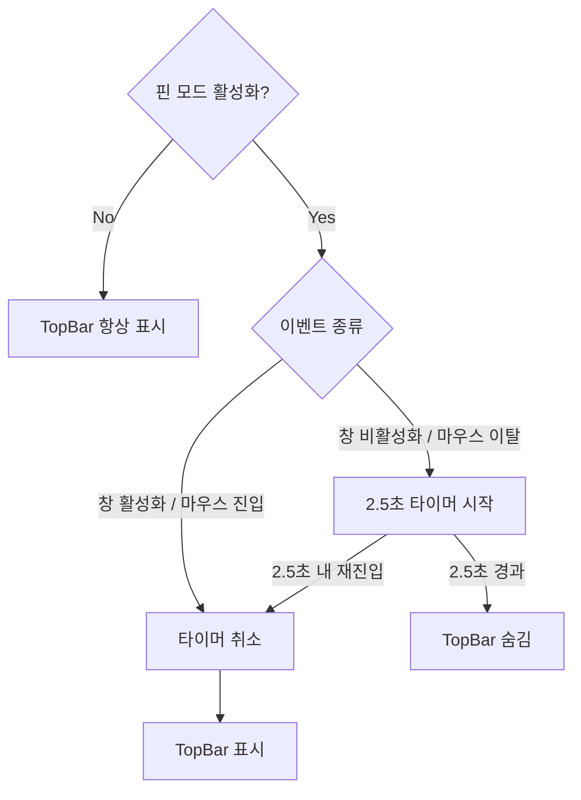
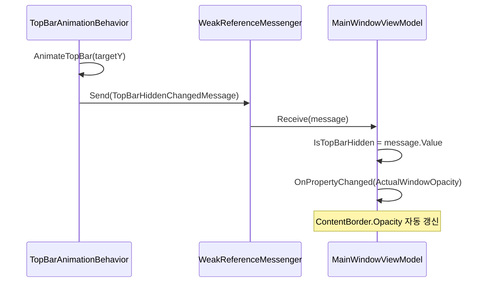

# TanukiTarkovMap 프로젝트 설계 문서

## 개요

Escape from Tarkov 게임을 위한 인터랙티브 맵 뷰어 애플리케이션.
CefSharp를 통해 tarkov-market.com의 맵을 표시하며, 게임 로그 감시를 통한 자동 맵 전환 기능을 제공.

---

## 아키텍처 다이어그램

### 전체 구조



### MVVM 데이터 흐름



### 맵 전환 시퀀스

#### 자동 맵 전환 (Tarkov 로그 감지)



#### 수동 맵 선택 (UI 드롭다운)



### UI 요소 숨기기 흐름



### 서비스 의존성



---

## 기술 스택

| 항목 | 기술/라이브러리 |
|------|-----------------|
| UI Framework | WPF (Windows Presentation Foundation) |
| Target Framework | .NET 8.0 |
| 웹뷰 | CefSharp.Wpf.NETCore |
| DI/IoC | Microsoft.Extensions.DependencyInjection |
| MVVM | CommunityToolkit.Mvvm |
| JSON | Newtonsoft.Json |
| 시스템 트레이 | Hardcodet.NotifyIcon.Wpf |

---

## 핵심 속성 (MainWindowViewModel)

```csharp
// 모드 상태
bool IsAlwaysOnTop        // 핀 모드 (TopMost)
bool IsTopmost            // 실제 TopMost 상태 (바인딩용)

// 핫키 설정
bool HotkeyEnabled        // 핫키 활성화 여부
string HotkeyKey          // 핫키 키 (기본: F11)

// UI 설정
bool HideWebElements      // 웹 UI 요소 숨김 여부
bool IsPmcExtraction      // Extraction 필터 (true=PMC, false=SCAV)

// 창 투명도
double WindowOpacity      // 사용자 설정 투명도 (0.1 ~ 1.0)
bool IsTopBarHidden       // TopBar 숨김 상태
double ActualWindowOpacity // 실제 적용 투명도 (계산됨)
                          // TopBar 보임 → 1.0
                          // TopBar 숨김 → WindowOpacity
```

---

## 프로젝트 구조

```
src/TanukiTarkovMap/
├── Models/
│   ├── Data/           # 데이터 모델 (MapInfo, Settings 등)
│   ├── FileSystem/     # 파일 시스템 감시 (LogsWatcher, ScreenshotsWatcher)
│   ├── JavaScript/     # CefSharp JavaScript 통합
│   ├── Services/       # 비즈니스 로직 서비스
│   └── Utils/          # 유틸리티 (Logger, HotkeyManager 등)
├── ViewModels/         # MVVM ViewModel
├── Views/              # WPF XAML 뷰
├── Converters/         # WPF Value Converters
└── Resources/          # XAML 리소스 (스타일)
```

---

## 서비스 아키텍처

### ServiceLocator 패턴

모든 서비스는 `ServiceLocator`를 통해 DI 컨테이너로 관리됨.

```csharp
// 서비스 접근
ServiceLocator.WebViewUIService
ServiceLocator.WindowBoundsService
ServiceLocator.MapEventService
ServiceLocator.WindowStateManager
```

### 주요 서비스

| 서비스 | 역할 |
|--------|------|
| `WebViewUIService` | CefSharp UI 요소 가시성 제어 |
| `WindowBoundsService` | 창 경계 체크 및 화면 내 위치 보정 |
| `WindowStateManager` | 창 상태 저장/복원 |
| `MapEventService` | 맵 변경 및 스크린샷 이벤트 발행 |
| `Settings` | 애플리케이션 설정 로드/저장 (JSON) |

### 서비스 생성자 규칙

```csharp
// internal 생성자로 외부 new 방지
internal ServiceName() { }

// ServiceLocator에서 Factory 패턴으로 생성
services.AddSingleton(_ => new ServiceName());
```

---

## 이벤트 흐름

### 맵 자동 전환

```
타르코프 로그 파일 변경
       ↓
  LogsWatcher 감지
       ↓
  MapEventService.RaiseMapChanged()
       ↓
  MainWindowViewModel.OnMapEventReceived()
       ↓
  ChangeMapCommand 실행
       ↓
  CefSharp URL 변경
```

---

## 설정 파일 구조

`settings.json` 위치: 실행 파일과 동일 디렉토리

```json
{
  "NormalLeft": 100,
  "NormalTop": 100,
  "NormalWidth": 1000,
  "NormalHeight": 700,
  "HotkeyEnabled": true,
  "HotkeyKey": "F11",
  "IsAlwaysOnTop": false,
  "WindowOpacity": 1.0
}
```

---

## UI 요소 숨기기 로직

### 개념

tarkov-market.com 웹페이지의 UI 요소들을 JavaScript로 제어하여 맵만 깔끔하게 표시.

### 요소 분류

| 요소 | 숨김 조건 | 복원 가능 |
|------|-----------| ----------|
| **헤더 (header)** | 항상 숨김 | X |
| **푸터 (footer-wrap)** | 항상 숨김 | X |
| **좌측 패널 (panel_left)** | 체크 시 숨김 | O |
| **우측 패널 (panel_right)** | 체크 시 숨김 | O |
| **상단 패널 (panel_top)** | 체크 시 숨김 | O |

### 동작 방식

```
페이지 로드 완료
       ↓
INIT_SCRIPT 실행 (함수들을 window 객체에 등록)
       ↓
헤더/푸터 항상 숨김 (window.hideHeader(), window.hideFooter())
       ↓
"UI 요소 숨기기" 체크 여부 확인
       ↓
  ┌─ 체크됨: 패널들도 숨김 (window.hidePanelLeft() 등)
  └─ 해제됨: 패널들 복원 (window.restorePanels())
       ↓
resize 이벤트 발생 → SVG 맵 레이아웃 재계산
```

### 핵심 원칙

1. **헤더/푸터는 항상 숨김**: 맵 이동, 체크 해제와 무관하게 절대 표시하지 않음
2. **패널만 토글 대상**: "UI 요소 숨기기" 체크박스는 좌/우/상단 패널에만 적용
3. **레이아웃 재계산**: 요소 숨김 후 `window.dispatchEvent(new Event('resize'))` 호출로 검은 영역 방지

### JavaScript 스크립트 구조

프로젝트의 JavaScript는 다음 패턴으로 관리됩니다:

```
Models/JavaScript/
├── Scripts/                      # 실제 JavaScript 파일 (Embedded Resource)
│   ├── web-elements-control.js   # UI 요소 제어 함수 정의
│   ├── page-layout.js            # 마진/패딩 제거
│   ├── connection-detector.js    # 연결 상태 감지
│   └── ...
├── WebElementsControl.js.cs      # C# 래퍼 (함수 호출용 상수)
├── PageLayout.js.cs              # C# 래퍼
├── ConnectionDetector.js.cs      # C# 래퍼
└── JavaScriptLoader.cs           # Embedded Resource 로더
```

**동작 원리:**
1. `.js` 파일: IIFE 패턴으로 함수들을 `window` 객체에 등록
2. `.js.cs` 파일: `JavaScriptLoader.Load()`로 스크립트 로드 + 함수 호출 상수 정의
3. `WebViewUIService`: 초기화 스크립트 → 함수 호출 순서로 실행

**예시 (WebElementsControl):**
```csharp
// 1. 함수 등록 (INIT_SCRIPT)
await browser.EvaluateScriptAsync(WebElementsControl.INIT_SCRIPT);

// 2. 함수 호출
await browser.EvaluateScriptAsync(WebElementsControl.HIDE_HEADER);  // "window.hideHeader();"
```

### 관련 파일

- `Scripts/web-elements-control.js`: JavaScript 함수 정의 (IIFE)
- `WebElementsControl.js.cs`: C# 래퍼 클래스 (INIT_SCRIPT, HIDE_* 상수)
- `WebViewUIService.cs`: 브라우저에 스크립트 실행 서비스
- `WebBrowserViewModel.cs`: 페이지 로드 시 `ApplyUIVisibilityAsync()` 호출
- `JavaScriptLoader.cs`: Embedded Resource에서 .js 파일 로드

---

## TopBar 자동 숨김 동작

### 개요

핀 모드(IsAlwaysOnTop) 활성화 시, TopBar가 자동으로 숨겨지는 기능.
마우스가 창을 떠나거나 창이 비활성화되면 2.5초 후 TopBar가 숨겨짐.

### 동작 흐름



### 트리거 조건

| 이벤트 | 동작 |
|--------|------|
| 창 활성화 (Activated) | 타이머 취소, TopBar 표시 |
| 창 비활성화 (Deactivated) | 2.5초 타이머 시작 |
| 마우스 진입 (MouseEnter) | 타이머 취소, TopBar 표시 |
| 마우스 이탈 (MouseLeave) | 2.5초 타이머 시작 |

### 투명도 연동

TopBar 상태에 따라 창 투명도가 자동 조절됨:

```
TopBar 표시 → ActualWindowOpacity = 1.0 (불투명)
TopBar 숨김 → ActualWindowOpacity = WindowOpacity (사용자 설정값)
```

### 메시지 흐름



### 관련 파일

- `Behaviors/TopBarAnimationBehavior.cs`: TopBar 애니메이션 및 타이머 로직
- `Messages/ViewModelMessages.cs`: TopBarHiddenChangedMessage 정의
- `ViewModels/MainWindowViewModel.cs`: IsTopBarHidden, ActualWindowOpacity 속성

---

## 용어 정리

| 용어 | 설명 |
|------|------|
| **핀 모드** | TopMost 설정 (항상 위에 표시) |
| **UI 요소 숨김** | JavaScript로 웹페이지 패널 제거 (헤더/푸터 제외) |
| **TopBar 자동 숨김** | 핀 모드에서 2.5초 지연 후 상단 바 자동 숨김 |
